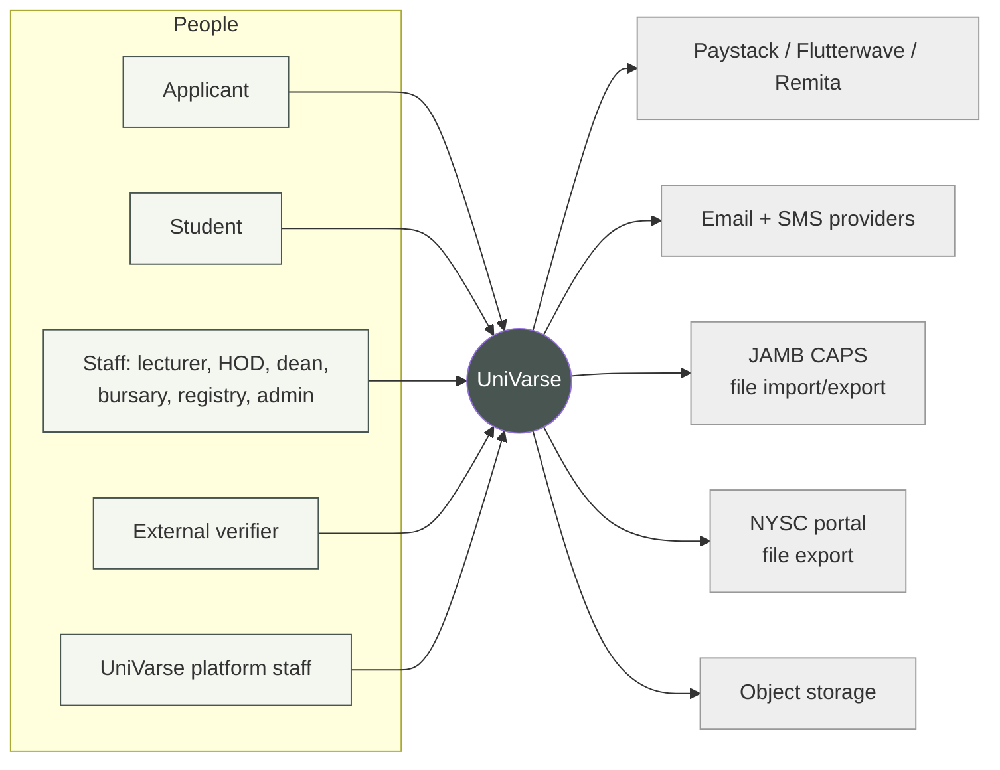
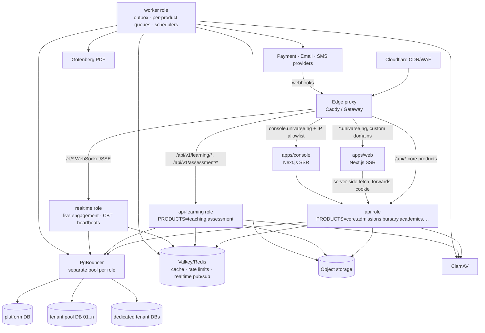

# 02 — Architecture

## 1. Architectural drivers

| Driver | Implication |
|--------|-------------|
| Strict tenant isolation, with some tenants wanting their own DB | Tenant isolation enforced **in PostgreSQL (RLS)**. A shard router supports pooled **and** dedicated databases with one schema |
| Complex, interlinked domain (registration ↔ fees ↔ results ↔ clearance) | **Modular monolith** with explicit module boundaries. One deployable, one transaction scope, no distributed-systems tax |
| Spiky load (registration opening, result release, admission list) | Stateless horizontally-scaled API, Redis caching, queues for heavy work, pre-computed results, CDN for static assets |
| Solo developer + AI assistance | One language (TypeScript) end to end, strong typing across the API boundary, conventions over cleverness |
| Long-lived records (transcripts are forever) | Immutable published results, append-only ledgers, hash-chained audit, careful migrations |
| Nigerian network conditions | Server-rendered pages, small JS bundles, printable outputs, idempotent retries, resumable test sessions |
| **Product suite that works independently and together** ([01 §5](01-product-brief.md)) | Products are first-class: per-tenant entitlements, runtime roles, bulkheads, cross-product contracts only ([§6.1](#61-products-runtime-roles-and-isolation-adr-020), ADR-020) |
| **CIA first**: integrity of results, assessments, finance and authentication | Same-transaction audit for consequential changes, immutable records, step-up, and integrity logs for CA tests |
| Real-time peaks (2,000 students starting a CA test in one minute; live lecture polls/Q&A) | A dedicated `realtime` runtime for WebSocket/SSE, test papers pre-generated at publish time, answers written idempotently with resume-after-disconnect |

## 2. Technology stack

| Concern | Choice | Notes |
|---------|--------|-------|
| Language | **TypeScript** (strict) everywhere | Node.js **24 LTS** runtime |
| Monorepo | **pnpm workspaces + Turborepo** | pnpm's strict node_modules and supply-chain settings ([09](09-container-security.md)) |
| Web apps | **Next.js 16 (App Router), React 19** | `apps/web` (tenant-facing), `apps/console` (platform) |
| UI | Tailwind CSS v4, shadcn/ui (Radix), lucide-react, TanStack Query/Table, react-hook-form, Recharts | Shared in `packages/ui` |
| API | **NestJS 11 on the Fastify adapter** | Modules, DI, guards and interceptors fit a large modular monolith |
| Validation / contracts | **zod** schemas in `packages/contracts` → OpenAPI → generated typed client | One schema validates both API input and UI forms |
| ORM | **Prisma** (latest major) with the `pg` driver adapter | Two schemas: `platform` and `tenant`. RLS policies in SQL migrations |
| Database | **PostgreSQL 18** (managed in prod) | Native `uuidv7()`, RLS, `pg_trgm` for search |
| Connection pooling | **PgBouncer** (transaction mode) | RLS context set with `SET LOCAL` inside each transaction |
| Cache / queues / rate limits | **Valkey (or Redis) 8** + **BullMQ** | Separate logical DBs/prefixes per concern |
| Object storage | **S3-compatible** (MinIO in dev; S3/R2 in prod) | Private buckets, presigned URLs |
| PDF generation | **Gotenberg** (sandboxed Chromium) as an internal service | Transcripts, receipts, dockets, letters. Keeps Chromium out of the API image |
| Malware scanning | **ClamAV** (clamd) internal service | All uploads scanned before use |
| Edge / reverse proxy | **Caddy** (compose) / Gateway API implementation, e.g. Envoy Gateway or Traefik (k8s) | Automatic TLS incl. on-demand TLS for verified custom domains |
| CDN / WAF / DDoS | **Cloudflare** (Lagos PoP) or equivalent | Static asset caching, bot/DDoS protection, WAF managed rules |
| Email / SMS | Transactional email provider (SES/Postmark/Resend) · Termii or Africa's Talking | Behind a `Messaging` port ([15](15-integrations.md)) |
| Payments | Paystack, Flutterwave, Remita | Behind a `PaymentGateway` port; the tenant supplies its own keys |
| Observability | OpenTelemetry → Grafana stack (Loki/Tempo/Prometheus/Mimir) + Sentry | [14](14-observability-and-operations.md) |
| IaC / deploy | Terraform (cloud resources) · Docker · Compose (dev/staging-lite) → Kubernetes + Helm (prod) | [10](10-infrastructure-and-deployment.md) |

Any change to this table requires an ADR.

## 3. System context (C4 level 1)



## 4. Containers (C4 level 2)



- **Same-origin API.** The browser always talks to `https://<tenant-host>/api/v1/...`. The edge routes by path prefix to the right runtime role, and everything else to Next.js. There's no CORS and cookies stay first-party.
- **One codebase, one image, several runtime roles** (ADR-020). Each process starts with `PRODUCTS=…` and mounts only those products. `worker` and `realtime` are separate entrypoints. Roles scale and fail independently. In dev, `PRODUCTS=all` runs everything in one process.
- The console is a separate app on a separate host with its own session cookie. Platform identities never exist in tenant databases.

## 5. Repository layout

```
univarse/
├── apps/
│   ├── web/                 # Next.js — public site, /apply, /student, /staff, /verify
│   ├── console/             # Next.js — platform console (UniVarse staff only)
│   └── api/                 # NestJS — src/main.ts (HTTP) and src/worker.ts (jobs)
│       └── src/
│           ├── platform/    # control-plane modules (tenants, provisioning, billing…)
│           ├── modules/     # tenant modules — one folder per bounded context
│           ├── shared/      # tenant context, db clients, auth guards, audit, outbox
│           └── main.ts / worker.ts
├── packages/
│   ├── contracts/           # zod schemas, DTO types, error codes, permission names
│   ├── domain/              # PURE engines: grading, GPA, standing, fee calc, matric generator
│   ├── db/                  # prisma/platform + prisma/tenant schemas, SQL (RLS), seeds, clients
│   ├── ui/                  # design system components + tokens
│   ├── api-client/          # generated typed client from OpenAPI
│   └── config/              # tsconfig, eslint, prettier presets
├── infra/
│   ├── docker/              # Dockerfiles (one per app)
│   ├── compose/             # compose.dev.yml, compose.ci.yml
│   ├── helm/univarse/       # Helm chart for prod/staging
│   └── terraform/           # cloud resources per environment
├── tools/                   # scripts, k6 load tests, codegen, RLS checker
├── docs/                    # this blueprint
└── CLAUDE.md                # agent operating manual (from docs/templates)
```

## 6. Bounded contexts (modules)

| Module (`apps/api/src/modules/…`) | Product | Owns | Depends on (via public service/events only) |
|---|---|---|---|
| `identity` | Core | users, credentials, MFA, sessions, roles, role assignments, permissions | org |
| `org` | Core | org units (colleges/faculties/departments/admin units), staff profiles | — |
| `calendar` | Core | sessions, semesters, windows (registration, score entry, CA tests…), session rollover (carryovers, spillovers) | — |
| `audit` | Core | append-only audit events, hash chain | — (called by all) |
| `settings` | Core | typed tenant configuration (`[CONFIG]` keys) | — |
| `files` | Core | file objects, scanning, presigned URLs | — |
| `comms` | Helpdesk & Comms | templates, notifications, announcements, outbound email/SMS (via outbox) | everyone (consumer of events) |
| `helpdesk` | Helpdesk & Comms | tenant-internal tickets, escalation to platform support | identity |
| `admissions` | Admissions | cycles, applications, O'level, screening, merit lists, offers | curriculum, finance, identity, records |
| `finance` | Bursary | fee items, schedules, invoices, ledger, payments, waivers, refunds, reconciliation | records, admissions |
| `curriculum` | Academics | programmes, courses, curriculum versions, prerequisites | org |
| `records` | Academics | students, status history, transfers, matric numbers | curriculum, identity |
| `registration` | Academics | course offerings, course registrations, add/drop, adviser approval | curriculum, calendar, records, finance |
| `exams` | Academics | exam periods, venues, timetable, invigilation, eligibility, dockets, malpractice | registration |
| `results` | Academics | assessment schemes, score sheets, workflow, published results, GPA snapshots, amendments | registration, records, domain engines, **assessment (CA scores via event)** |
| `graduation` | Academics | clearance, degree audit, graduation lists, transcripts, certificates, NYSC | results, finance, records, hostel |
| `teaching` | Teaching & Learning | course spaces, materials, announcements, live engagement sessions (attendance check-in, polls, Q&A), assignments, submissions, feedback | registration (class lists), files, calendar |
| `assessment` | Assessment (CA CBT) | question banks, CA test definitions, generated papers, attempts, answers, integrity events, marking | registration (eligible candidates), calendar (windows), files; **publishes** `assessment.ca_scores_released` → results |
| `hostel` | Student Affairs | hostels, rooms, bed spaces, applications, allocations | records, finance |
| `reporting` | Reporting | read models, dashboards, exports, NUC returns | reads replicas/read models |

Platform modules (`apps/api/src/platform/…`): `tenants`, `provisioning`, `shards`, `billing`, `platform-identity`, `platform-support`, `announcements`, `feature-flags`, `platform-audit`, `migrations-runner`.

### 6.1 Products, runtime roles and isolation (ADR-020)

| Concern | Mechanism |
|---|---|
| **Enable per tenant** | `tenant_product` entitlements (platform DB, cached). Every controller and job consumer declares `@Product('…')`. Requests to a disabled product get **404** server-side, and its jobs are skipped |
| **Run independently** | Runtime roles chosen by `PRODUCTS=…` (api, api-learning, realtime, worker). A product's controllers and consumers mount only in its role |
| **Fail independently** | Per-role PgBouncer pools and connection budgets, per-product queues with concurrency caps, per-product rate-limit buckets, timeouts and circuit breakers on cross-product calls |
| **Depend safely** | Cross-product data flows through **events** (e.g. `assessment.ca_scores_released` → `results`) or a product's published service contract, never another product's tables. Dependency-cruiser enforces product boundaries in CI |
| **Observe** | Per-product SLO dashboards and alerts. The GA gate includes a cross-product isolation load test (saturate Assessment, Bursary p95 stays within SLO) |

**Degradation examples:**
- If Assessment is down, everything else works, and in-progress tests resume when it returns (answers already saved are durable).
- If Bursary's payment gateway is down, registration shows "payment pending" instead of failing.
- If `realtime` is down, live polls fall back to polling HTTP, and CBT heartbeats queue client-side.

### Module rules (MUST)
1. A module **owns its tables**. No other module queries them directly. It calls the owning module's exported **application service** or reacts to its **events**.
2. Each module exposes `index.ts` with its public API. ESLint `no-restricted-imports` / dependency-cruiser enforces this in CI.
3. Cross-module writes that must be atomic call services inside the same transaction (`TenantTx` passed explicitly). Otherwise they use **events via the outbox**.
4. Business calculations (grades, GPA, fees, standings) live in `packages/domain` as **pure functions** with no IO. Modules load data, call the engine and persist results.
5. No circular module dependencies. The dependency graph is checked in CI.
6. Every module declares its **product** (ADR-020). A module may depend on another product's module only through that product's exported contract or its events.

### Internal layering inside a module
```
modules/results/
├── api/             # controllers, request/response mapping, guards (thin)
├── application/     # use cases (commands/queries), transactions, authorization checks
├── domain/          # entities, value objects, state machines, domain events (no Nest, no Prisma)
├── infrastructure/  # repositories (Prisma), gateways, job processors
└── index.ts         # public surface for other modules
```

## 7. Multi-tenancy

**Decision ([ADR-004](19-decision-log.md)): pooled by default, silo on demand, RLS always.**

### 7.1 Data placement
- **`platform` DB:** tenant registry, domains, shards, plans, subscriptions, platform users/sessions/audit, provisioning jobs, migration runs. No tenant personal data.
- **Tenant shard DBs:** every tenant-owned table has `tenant_id uuid NOT NULL`, and every table has RLS enabled **and forced**.
  - `pool-01`, `pool-02`… hold many tenants. Add a new pool when one reaches roughly 50 tenants or 500 GB.
  - A **dedicated** shard holds exactly one tenant, with the **same schema and same RLS**. The only difference is placement.

### 7.2 Request flow

```mermaid
sequenceDiagram
  participant B as Browser
  participant E as Edge
  participant A as API
  participant T as TenantResolver
  participant R as Redis
  participant D as Tenant shard (RLS)
  B->>E: GET https://unilag.univarse.ng/api/v1/students/me
  E->>A: forwards Host + X-Request-Id
  A->>T: resolve(host)
  T->>R: cache lookup host→tenant
  T-->>A: {tenantId, shardId, status}
  A->>A: reject if status ∉ {ACTIVE} (SUSPENDED → 423)
  A->>R: load session (cookie) → user must belong to tenantId
  A->>A: TenantGuard attaches ctx {tenantId, shardId} to the request; handlers receive it via @CurrentTenant()
  A->>D: BEGIN; SELECT set_config('app.tenant_id', $tenantId, true); <query>; COMMIT
  D-->>A: only rows where tenant_id = app.tenant_id
  A-->>B: 200 JSON
```

1. **Tenant resolution comes from the Host header only** (subdomain or verified custom domain). It never comes from a request body, query string or client header in production. In development, `X-Tenant-Slug` is accepted **only** when `NODE_ENV=development`.
2. The session is bound to a tenant. A session cookie presented on another tenant's host is rejected (401) and logged as a security event.
3. `ShardRegistry.forTenant(ctx.shardId, ctx.tenantId)` (or `.tx(...)` for multi-statement use cases) returns a client for the tenant's shard. Context is passed explicitly, never via globals or AsyncLocalStorage. It wraps every operation in a transaction that first runs `set_config('app.tenant_id', …, true)` (transaction-local, safe with PgBouncer transaction pooling).
4. RLS policy on every tenant table:
   ```sql
   ALTER TABLE student ENABLE ROW LEVEL SECURITY;
   ALTER TABLE student FORCE ROW LEVEL SECURITY;
   CREATE POLICY tenant_isolation ON student
     USING (tenant_id = nullif(current_setting('app.tenant_id', true), '')::uuid)
     WITH CHECK (tenant_id = nullif(current_setting('app.tenant_id', true), '')::uuid);
   ```
   If the context isn't set, queries return **zero rows** and inserts fail. The system fails closed.
5. The app connects as `univarse_app`: not table owner, `NOBYPASSRLS`. Migrations run as `univarse_migrator`. See [07](07-data-and-database.md).
6. **Jobs carry `tenantId`** in their payload. The worker re-establishes tenant context before running. A job without `tenantId` can only use the platform client.
7. **Caches are namespaced:** `t:{tenantId}:…`. A cache helper that doesn't take a tenant ID doesn't exist for tenant data.
8. **Object keys are prefixed:** `tenants/{tenantId}/…`. Presigned URLs are only issued after an authorization check.

### 7.3 Tenant lifecycle

**Propagation of status changes.** Each API instance caches host → tenant (including status) for `TENANT_CACHE_TTL_MS` (default 30 s). The instance performing a lifecycle change invalidates its own cache immediately. **Other instances converge within the TTL**, so a suspension may take up to 30 s to block every request cluster-wide. Before multi-instance production, publish lifecycle changes over Valkey pub/sub so all instances invalidate at once (tracked in the roadmap). Already-issued sessions are covered: the tenant guard runs before session lookup on every request, and this is tested.

`REQUESTED → PROVISIONING → ONBOARDING → ACTIVE ⇄ SUSPENDED → OFFBOARDING (60-day export window) → ARCHIVED → PURGED`. See [03](03-domain-model.md) §12 for the state machine. Provisioning is an idempotent, resumable job: create tenant rows → seed defaults (roles, grading scheme, settings) → create first institution admin → DNS/TLS for the subdomain → mark ONBOARDING.

### 7.4 Promotion pool → dedicated
This is a platform job: freeze writes for the tenant (maintenance flag) → export tenant rows by `tenant_id` → import into the new shard → verify row counts and checksums → switch the `shardId` in the registry → unfreeze. Plan it for ≤ 30 min of read-only time for a large tenant.

## 8. Authentication and authorization (summary; detail in [08](08-security.md))

- **Server-side sessions**: opaque random ID in a `__Host-` HttpOnly Secure SameSite=Lax cookie. The session record is in Redis with a durable copy in Postgres. There are no JWTs in the browser.
- **RBAC with scopes.** A `RoleAssignment(user, role, scopeType, scopeId, validFrom, validTo)` grants permissions (`results.scoresheet.approve_hod`) inside a scope. The policy layer answers `can(actor, action, resource)` by matching the resource's org path against the actor's scopes.
- **Separation of duties** is enforced in use cases, e.g. the person who submitted a score sheet can't approve it at the next stage.
- **Step-up authentication** (recent MFA ≤ 5 min) for sensitive actions.

## 9. Asynchronous processing

- **Transactional outbox.** A use case writes its domain event row to `outbox_event` in the same transaction. A relay (worker) publishes to BullMQ and marks it sent. Consumers are **idempotent**, keyed by event ID.
- **Queues by concern:** `notifications`, `payments` (webhook processing, reconciliation), `documents` (PDFs), `imports`, `results` (GPA recomputation, publication fan-out), `platform` (provisioning, migrations), `maintenance`.
- **Schedulers** (BullMQ repeatable jobs, with a single leader): payment reconciliation, deletion warnings, session cleanup, retention purges, nightly tenant exports, window open/close notifications.
- **Long-running API operations** return `202 Accepted` with a `Job` resource the UI polls or subscribes to over SSE.

## 10. Performance and scalability design

| Spike | Tactics |
|-------|---------|
| **Result release** | Results are published as immutable `course_result` + `semester_result` rows, computed ahead of time. The student results endpoint is a single indexed read, cached per student with invalidation on amendment. Stagger notifications. Rate limit per session |
| **Registration opening** | Offerings and curriculum are cached per semester. Registration writes are small. Capacity-limited offerings use `SELECT … FOR UPDATE` on the offering row. Queue-based waiting room at the edge if needed |
| **Payment webhooks storm** | Webhook endpoint only verifies the signature and enqueues (≤ 50 ms). Processing is async and idempotent |
| **Broadsheet / reports** | Served from a read replica / materialized read models, generated as async exports for large sets |
| **Bulk imports** | Upload → async validate → preview → commit in batches of 1,000 rows |

Scale-out order: API/worker replicas → Redis sizing → read replica for reporting → more pool shards → dedicated shards for the largest tenants.

## 11. Configuration model

- **Platform config:** env vars validated at boot with zod (the app refuses to start on invalid config). Secrets come from the secret manager.
- **Tenant config:** the `settings` module holds typed keys (`grading.scheme`, `registration.maxUnitsPerSemester`, `results.approvalStages`, `matric.template`, …). Each key has a zod schema, a default, a scope (tenant / faculty / programme) and an effective date where relevant. Settings are versioned, and changes are audited.
- **Feature flags:** platform-managed per tenant (`feature.hostel`, `feature.remita`), cached in Redis.

## 12. Cross-cutting concerns checklist (every endpoint/use case)

- [ ] Tenant context established (automatic via guard) and RLS-backed client used
- [ ] Authorization check with the resource's scope, not just the role name
- [ ] Input validated with the zod contract, and output mapped to a response DTO (never return Prisma entities)
- [ ] Audit event written for consequential changes
- [ ] Idempotency for create/payment/import operations
- [ ] Domain event via outbox where other modules care
- [ ] Rate limit category assigned
- [ ] Tests: unit (domain), integration (use case + DB + RLS), and e2e for the critical journey
