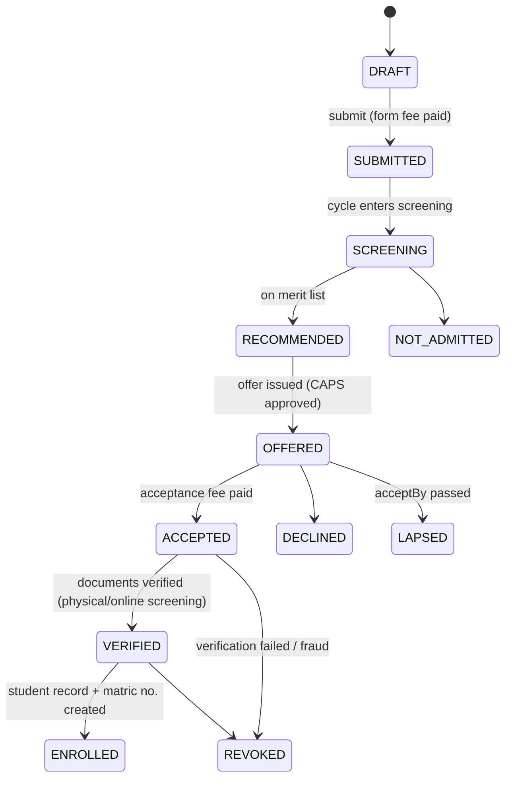
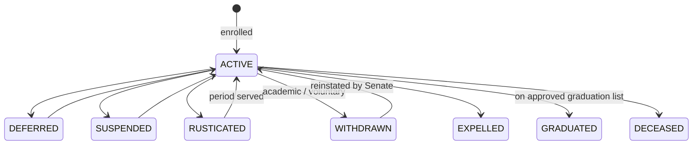
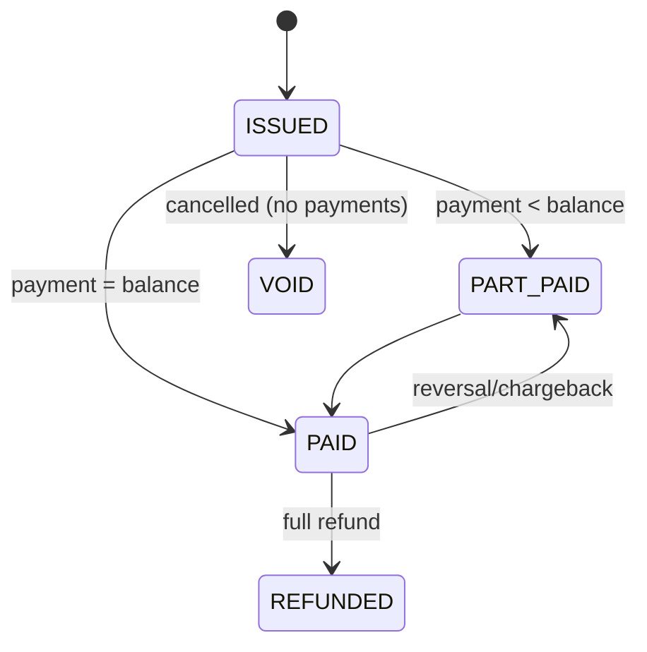
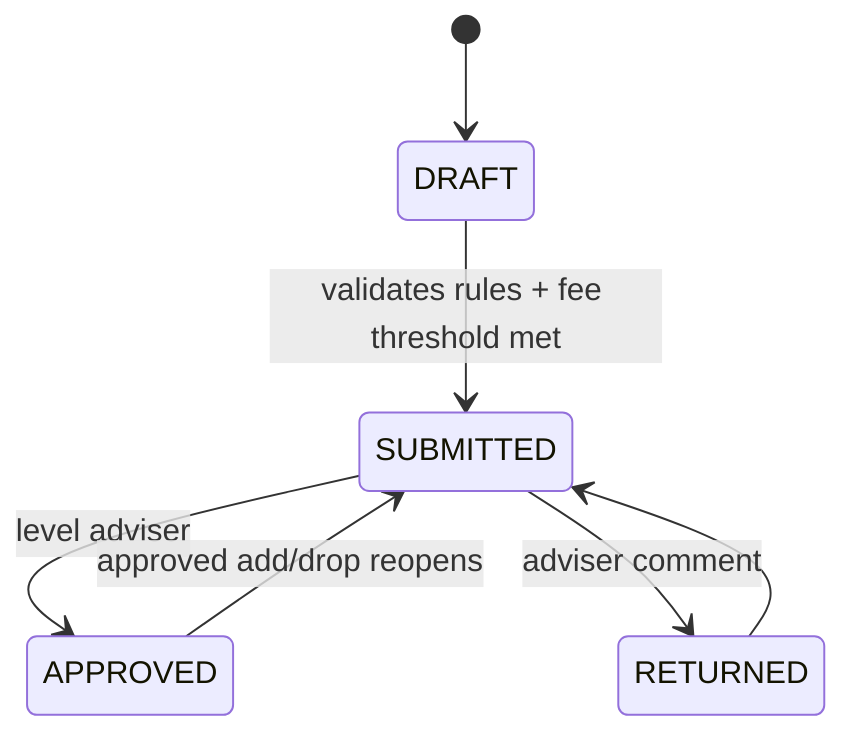
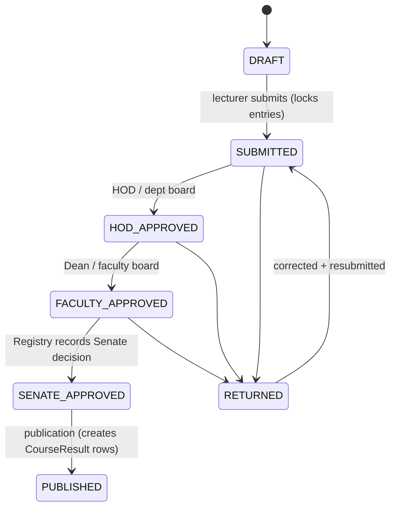
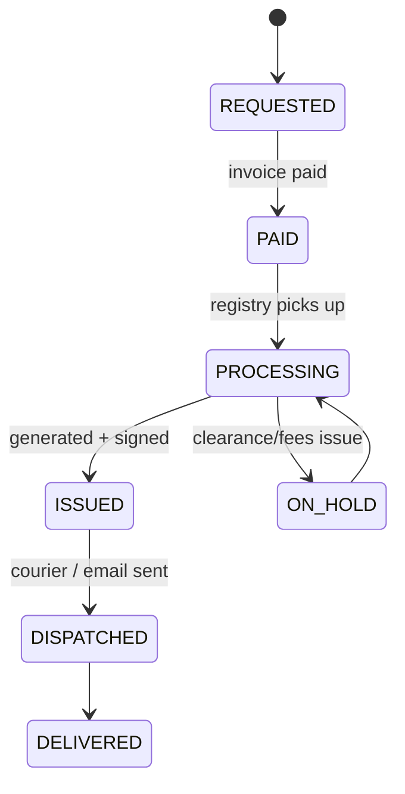
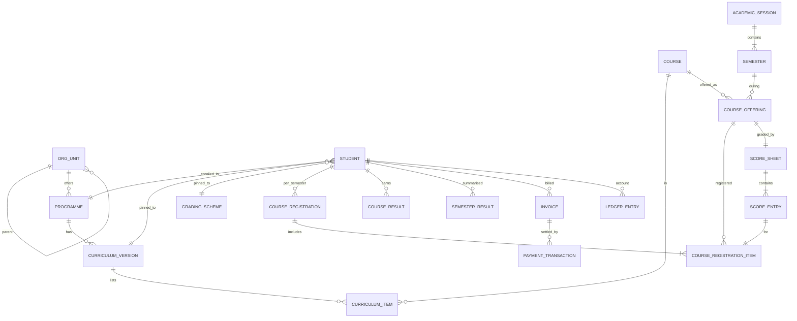

# 03 — Domain Model

Entities per bounded context, their key fields, invariants and lifecycles. This is the **logical** model. Physical conventions (naming, IDs, audit columns, RLS) are in [07-data-and-database.md](07-data-and-database.md).

> Every tenant entity implicitly has `id (uuidv7)`, `tenant_id`, `created_at`, `updated_at`, `created_by`, `updated_by` and, where mutable and concurrency-sensitive, `version` (optimistic lock). These aren't repeated below.

---

## 1. Platform (platform DB)

| Entity | Key fields | Notes |
|--------|-----------|-------|
| `Tenant` | slug, legalName, shortName, type (`UNIVERSITY`/`POLYTECHNIC`/`COLLEGE_OF_EDUCATION`), ownership (`FEDERAL`/`STATE`/`PRIVATE`), status, tier (`POOLED`/`DEDICATED`), shardId, region, suspendedReason, offboardingStartedAt, purgeAfter | slug is immutable and becomes the subdomain |
| `TenantDomain` | tenantId, hostname, kind (`SUBDOMAIN`/`CUSTOM`), verificationToken, verifiedAt, tlsStatus | Custom domains are verified by a DNS TXT record |
| `Shard` | name, kind (`POOL`/`DEDICATED`), connectionSecretRef, region, status, tenantCount | The connection string lives in the secret manager, not the DB |
| `Plan`, `Subscription`, `PlatformInvoice` | pricePerStudentKobo, billingCycle, studentCountSnapshot | Platform revenue only |
| `PlatformUser`, `PlatformSession`, `PlatformMfaFactor` | email, role (`OWNER`/`SUPER_ADMIN`/`SUPPORT`/`FINANCE`/`READ_ONLY`), ipAllowlist | Never stored in tenant DBs |
| `ProvisioningJob`, `MigrationRun` | tenantId/shardId, step, status, log | Resumable, idempotent |
| `TenantFeature` | tenantId, flag, enabled | |
| `PlatformAnnouncement`, `PlatformTicket`, `PlatformTicketMessage` | | Tenant admins ↔ UniVarse support |
| `PlatformAuditEvent` | actor, action, tenantId?, metadata, ip, prevHash, hash | Hash-chained |

## 2. Identity & access

| Entity | Key fields | Invariants |
|--------|-----------|-----------|
| `User` | email?, phone?, username (matric no./staff no./application no.), passwordHash (argon2id), status (`PENDING_ACTIVATION`/`ACTIVE`/`LOCKED`/`DISABLED`), displayName, lastLoginAt | Unique `(tenant_id, lower(email))` and `(tenant_id, username)` |
| `MfaFactor` | userId, type (`TOTP`/`WEBAUTHN`/`RECOVERY_CODES`), secretEnc, label, lastUsedAt | Secrets encrypted with envelope encryption |
| `Session` | idHash, userId, createdAt, lastSeenAt, idleExpiresAt, absoluteExpiresAt, mfaAt, ip, userAgent, revokedAt | Stored hashed |
| `Role` | key, name, isSystem, permissions[] | System roles are seeded. Tenants may create custom roles from the permission catalog |
| `RoleAssignment` | userId, roleId, scopeType (`INSTITUTION`/`ORG_UNIT`/`PROGRAMME`/`COHORT`/`COURSE_OFFERING`/`HOSTEL`), scopeId, validFrom, validTo, grantedBy, reason | Temporal (acting HOD, tenure). Granting is audited and needs step-up |
| `ActivationToken`, `PasswordResetToken` | tokenHash, userId, channel, expiresAt, usedAt | Single-use, ≤ 30 min |
| `LoginAttempt` | username, ip, success, reason | For lockout and threat detection |

**System roles** (seed): `INSTITUTION_ADMIN`, `REGISTRAR`, `EXAMS_RECORDS_OFFICER`, `ADMISSIONS_OFFICER`, `BURSAR`, `BURSARY_OFFICER`, `DEAN`, `HOD`, `LEVEL_ADVISER`, `LECTURER`, `STUDENT_AFFAIRS_OFFICER`, `HOSTEL_OFFICER`, `LIBRARIAN`, `CLEARANCE_OFFICER`, `MANAGEMENT_VIEWER`, `HELPDESK_AGENT`, `STUDENT`, `APPLICANT`.

## 3. Organization

| Entity | Key fields | Notes |
|--------|-----------|-------|
| `OrgUnit` | code, name, kind (`ACADEMIC`/`ADMINISTRATIVE`), type (`COLLEGE`/`FACULTY`/`SCHOOL`/`DEPARTMENT`/`INSTITUTE`/`CENTRE`/`UNIT`), parentId, path (ltree or materialized path), status | A tree handles University → College → Faculty → Department variations. The `path` enables scope checks (`resource.path <@ scope.path`) |
| `StaffProfile` | userId, staffNumber, title, rank, primaryOrgUnitId, employmentType, status | |

## 4. Curriculum

| Entity | Key fields | Invariants |
|--------|-----------|-----------|
| `Programme` | code, name, award (`B.Sc.`, `B.Eng.`, `LL.B`, `MBBS`…), departmentId, normalDurationYears, maxDurationYears, entryModes[], minUnitsToGraduate, status | |
| `Course` | code (`CSC 201`), title, creditUnits, ownerDepartmentId, description, courseType (`LECTURE`/`PRACTICAL`/`SEMINAR`/`PROJECT`/`SIWES`), status | Unique `(tenant, code)`. Units changes only affect **future** offerings |
| `CurriculumVersion` | programmeId, name, effectiveFromCohortSessionId, status (`DRAFT`/`APPROVED`/`RETIRED`), approvedBy/At | Students are pinned to the version of their cohort |
| `CurriculumItem` | curriculumVersionId, courseId, level, semesterNumber, category (`COMPULSORY`/`REQUIRED`/`ELECTIVE`/`GENERAL_STUDIES`), electiveGroupId? | |
| `ElectiveGroup` | curriculumVersionId, name, minUnits, maxUnits | |
| `Prerequisite` | courseId, requiresCourseId, kind (`PASSED`/`TAKEN`), curriculumVersionId? | |
| `CourseEquivalence` | courseId, equivalentCourseId, fromSession | Handles code renames across curricula |

## 5. Academic calendar

| Entity | Key fields | Invariants |
|--------|-----------|-----------|
| `AcademicSession` | name (`2025/2026`), startDate, endDate, status (`PLANNED`/`ACTIVE`/`CLOSED`) | At most one `ACTIVE` per tenant |
| `Semester` | sessionId, number (1/2), name, startDate, endDate, status | At most one `ACTIVE` per tenant |
| `CalendarWindow` | type (`APPLICATION`/`COURSE_REGISTRATION`/`LATE_REGISTRATION`/`ADD_DROP`/`FEE_PAYMENT`/`SCORE_ENTRY`/`HOSTEL_APPLICATION`/`CLEARANCE`), semesterId?/sessionId?, opensAt, closesAt, scopeType?, scopeId? | Times are stored UTC and shown in `Africa/Lagos` |

## 6. Admissions

| Entity | Key fields |
|--------|-----------|
| `AdmissionCycle` | sessionId, name, entryModes[], formFeeItemId, status (`DRAFT`/`OPEN`/`SCREENING`/`OFFERS`/`CLOSED`), aggregateFormula (config), quotaPolicy (config) |
| `Applicant` | userId, surname, firstName, otherNames, dob, sex, stateOfOrigin, lga, nationality, phone, email, photoFileId |
| `Application` | cycleId, applicantId, applicationNumber, entryMode, jambRegNumber, utmeScore, utmeSubjects[], firstChoiceProgrammeId, secondChoiceProgrammeId?, status, submittedAt |
| `OlevelSitting` / `OlevelGrade` | examBody (`WAEC`/`NECO`/`NABTEB`/`GCE`), examYear, examNumber, scratchCardRef?, subjects+grades, verificationStatus |
| `DirectEntryQualification` | type (`A_LEVEL`/`ND`/`NCE`/`IJMB`/`JUPEB`/`DEGREE`), institution, grade/CGPA, fileId |
| `ScreeningScore` | applicationId, component (`POST_UTME`/`INTERVIEW`/`OLEVEL_POINTS`), score, source (`IMPORT`/`MANUAL`) |
| `MeritList`, `MeritListEntry` | cycleId, programmeId, quotaCategory (`MERIT`/`CATCHMENT`/`ELDS`/`DISCRETIONARY`), rank, aggregate, decision |
| `AdmissionOffer` | applicationId, programmeId, entryLevel, status, offeredAt, acceptBy, acceptedAt, capsStatus |
| `DocumentVerification` | applicationId, documentType, fileId, status, officerId, comment |

## 7. Student records

| Entity | Key fields | Invariants |
|--------|-----------|-----------|
| `Student` | userId, matricNumber, applicationId?, programmeId, curriculumVersionId, gradingSchemeId, cohortSessionId, entryMode, entryLevel, currentLevel, status, academicStanding, expectedGraduationSessionId, isSpillover | matricNumber unique per tenant and **immutable** except by audited correction. gradingSchemeId is pinned at enrolment |
| `StudentPersonal` | studentId, dob, sex, stateOfOrigin, lga, address, nextOfKin, disability?, ninEnc?, bloodGroup? | Restricted access (sensitive) |
| `StudentStatusChange` | studentId, from, to, reason, effectiveFrom, effectiveTo?, approvedBy, documentFileId | Append-only history |
| `ProgrammeTransfer` | studentId, fromProgrammeId, toProgrammeId, creditedCourses[], status, approvals | |

## 8. Finance

| Entity | Key fields | Invariants |
|--------|-----------|-----------|
| `FeeItem` | code, name, category (`TUITION`/`ACCEPTANCE`/`APPLICATION`/`SUNDRY`/`HOSTEL`/`TRANSCRIPT`/`PENALTY`/`OTHER`), revenueCode (TSA/GL), isRefundable | |
| `FeeSchedule` | sessionId, name, status (`DRAFT`/`APPROVED`), rules[] (criteria → items+amounts), installmentPlan | Approved schedules are immutable. Changes create a new version |
| `Invoice` | number, payerType (`STUDENT`/`APPLICANT`/`EXTERNAL`), payerId, sessionId, purpose, lines[], totalKobo, paidKobo, status, dueAt | `paidKobo ≤ totalKobo` unless there's an overpayment credit. Lines are immutable once issued |
| `LedgerEntry` | accountId (per payer), type (`CHARGE`/`PAYMENT`/`WAIVER`/`REFUND`/`ADJUSTMENT`/`REVERSAL`), amountKobo (signed), invoiceId?, paymentId?, memo | **Append-only.** Balance = Σ amount. Corrections are reversal entries |
| `PaymentTransaction` | invoiceId, gateway, merchantReference (ours), gatewayReference (RRR/Paystack ref), amountKobo, channel, status (`INITIATED`/`PENDING`/`SUCCEEDED`/`FAILED`/`ABANDONED`/`REVERSED`), verifiedAt, rawPayloadHash | Unique `(gateway, gatewayReference)`. Only a server-side verification or signed webhook moves it to `SUCCEEDED` |
| `Receipt` | number (sequential per tenant), paymentTransactionId, verificationCode, fileId | |
| `Waiver` / `Scholarship` | payerId, feeItemId?, percent/amountKobo, reason, status, requestedBy, approvedBy | Requester ≠ approver |
| `Refund` | paymentTransactionId, amountKobo, status, approvals, externalRef | |
| `GatewayConfig` | gateway, publicKey, secretKeyEnc, webhookSecretEnc, subaccount/serviceTypeIds, mode (`TEST`/`LIVE`) | The tenant owns the gateway account |
| `ReconciliationRun` / `ReconciliationItem` | gateway, window, matched, missingLocal, missingRemote, amountMismatch | |

## 9. Course registration

| Entity | Key fields | Invariants |
|--------|-----------|-----------|
| `CourseOffering` | courseId, semesterId, capacity?, status (`PLANNED`/`OPEN`/`CLOSED`), assessmentSchemeId | Unique `(courseId, semesterId)` (sections optional later) |
| `CourseOfferingStaff` | offeringId, staffId, role (`COORDINATOR`/`LECTURER`/`EXAMINER`) | Grants `COURSE_OFFERING` scope implicitly |
| `CourseRegistration` | studentId, semesterId, level, status (`DRAFT`/`SUBMITTED`/`APPROVED`/`RETURNED`), totalUnits, submittedAt, approvedBy/At | One per student per semester |
| `CourseRegistrationItem` | registrationId, offeringId, attemptType (`FRESH`/`CARRYOVER`/`REPEAT`/`ELECTIVE`/`AUDIT`), status (`ACTIVE`/`DROPPED`) | A student can't hold two active items for the same course in a semester |
| `AddDropRequest` | registrationId, add[], drop[], status, approvals | Only inside the ADD_DROP window |

## 10. Examinations

| Entity | Key fields |
|--------|-----------|
| `ExamPeriod` | semesterId, name, startDate, endDate, status |
| `Venue` | code, name, type (`HALL`/`LAB`/`CLASSROOM`/`CBT_CENTRE`), capacity, examCapacity, location |
| `ExamSlot` | examPeriodId, offeringId, startsAt, endsAt, status |
| `ExamSlotVenue` | slotId, venueId, allocatedSeats |
| `InvigilatorAssignment` | slotId, venueId, staffId, role (`CHIEF`/`INVIGILATOR`) |
| `ClassAttendance` (optional) | offeringId, studentId, sessionsHeld, sessionsAttended | For the eligibility rule |
| `ExamEligibility` | registrationItemId, eligible, reasons[] (`FEES`/`ATTENDANCE`/`NOT_APPROVED`) |
| `ExamDocket` | studentId, semesterId, verificationCode, fileId |
| `MalpracticeCase` | studentId, offeringId, description, evidenceFileIds, status, decision, sanction |

Invariants: no student has two overlapping exam slots, venue seats ≥ candidates, and no invigilator is double-booked (checked on save; the timetable UI shows conflicts).

## 11. Results

| Entity | Key fields | Invariants |
|--------|-----------|-----------|
| `GradingScheme` | name, bands[] ({minScore, maxScore, grade, gradePoint, isPass}), passMark, effectiveFromCohortSessionId, status | Immutable once used. New rules mean a new scheme |
| `AssessmentScheme` | components[] ({key: `CA1`, label, maxScore}), examMaxScore | Σ max = 100 |
| `ScoreSheet` | offeringId, status, currentStage, version, submittedBy/At, lockedAt, checksum | One per offering. Editable only in `DRAFT`/`RETURNED` |
| `ScoreEntry` | scoreSheetId, studentId, registrationItemId, components (json), examScore, total, grade, gradePoint, remark (`ABS`/`INC`/`MAL`/`SICK`/null) | Scores within component max. total = Σ components (+ rounding rule) |
| `ScoreSheetEvent` | scoreSheetId, fromStatus, toStatus, action (`SUBMIT`/`APPROVE`/`RETURN`/`PUBLISH`), actorId, comment, snapshotHash | Append-only. snapshotHash = hash of all entries at that moment |
| `CourseResult` | studentId, courseId, offeringId, semesterId, sessionId, creditUnits, score, grade, gradePoint, attemptNumber, attemptType, remark, publishedAt, sourceScoreSheetVersion | **Immutable.** Changes only via `ResultAmendment` |
| `SemesterResult` | studentId, semesterId, tcu, tcp, gpa, cumulativeTcu, cumulativeTcp, cgpa, outstandingCourses[], standing, computedAt, engineVersion | Recomputed from `CourseResult` by the domain engine |
| `ResultAmendment` | courseResultId, oldValues, newValues, reason, evidenceFileId, status, approvals[] | Must pass the same approval stages as the original |
| `ResultRemarkCode` | code, label, gradeTreatment (`AS_F`/`EXCLUDE`/`PENDING`) | `[CONFIG]` |

The stages are `[CONFIG]` per tenant (`results.approvalStages`). Some institutions publish provisionally after the faculty stage. `RETURNED` always goes back to the lecturer, with a mandatory comment.

## 12. Graduation, clearance and transcripts

| Entity | Key fields |
|--------|-----------|
| `ClearanceTemplate` | purpose (`GRADUATION`/`WITHDRAWAL`/`TRANSFER`/`SESSION_END`), steps[] ({unit, order, dependsOn[], autoCheck?}) |
| `ClearanceCase` | studentId, templateId, status (`OPEN`/`IN_PROGRESS`/`CLEARED`/`BLOCKED`) |
| `ClearanceStep` | caseId, unit (`DEPARTMENT`/`FACULTY`/`LIBRARY`/`BURSARY`/`HOSTEL`/`SPORTS`/`STUDENT_AFFAIRS`/`MEDICAL`/`ALUMNI`), status (`PENDING`/`CLEARED`/`REJECTED`), officerId, comment, autoResult | Auto-checks: bursary → ledger balance ≤ 0, hostel → no open allocation/damages, library → integration or manual |
| `DegreeAudit` | studentId, curriculumVersionId, satisfied, missingCourses[], unitsEarned, finalCgpa, proposedClass, computedAt |
| `GraduationList` | sessionId, orgUnitId (faculty), status (`DRAFT`/`FACULTY_APPROVED`/`SENATE_APPROVED`), entries[] |
| `GraduationListEntry` | studentId, finalCgpa, degreeClass, awardTitle, graduationDate, notes |
| `TranscriptRequest` | requesterStudentId, type (`STUDENT_COPY`/`OFFICIAL`), destination (institution/email/address), deliveryMethod (`EMAIL_PDF`/`COURIER`/`PICKUP`), invoiceId, status, trackingRef |
| `IssuedDocument` | type (`TRANSCRIPT`/`CERTIFICATE`/`RECEIPT`/`DOCKET`/`ADMISSION_LETTER`/`STATEMENT_OF_RESULT`), subjectId, fileId, sha256, verificationCode, issuedAt, revokedAt | Public verification by code |
| `NyscList`, `NyscListEntry` | sessionId, batch, entries with the required NYSC fields `[VERIFY]` format |

## 13. Hostel

| Entity | Key fields |
|--------|-----------|
| `Hostel` | name, sex (`MALE`/`FEMALE`/`MIXED`), location, status |
| `Room` | hostelId, block, number, capacity, type, isReserved |
| `BedSpace` | roomId, label, status (`AVAILABLE`/`HELD`/`OCCUPIED`/`OUT_OF_SERVICE`) |
| `AllocationRound` | sessionId, eligibilityRules (config), priorityRules (config), window |
| `HostelApplication` | studentId, roundId, preferences[], status |
| `HostelAllocation` | studentId, bedSpaceId, sessionId, status (`HELD`/`CONFIRMED`/`EXPIRED`/`VACATED`), holdExpiresAt, invoiceId, checkInAt, checkOutAt, damages[] |

Invariant: a bed space has at most one `HELD`/`CONFIRMED` allocation per session (enforced with a partial unique index).

## 14. Communications, helpdesk, files, audit, settings

| Entity | Key fields |
|--------|-----------|
| `MessageTemplate` | key, channel, subject, body (Handlebars/MJML), locale, version |
| `Notification` | userId, type, title, body, link, readAt |
| `OutboundMessage` | channel (`EMAIL`/`SMS`), to, templateKey, status, provider, providerRef, attempts, costKobo |
| `Announcement` | title, body (sanitized), audience (rules: roles/org units/levels), publishAt, expiresAt |
| `Ticket`, `TicketMessage` | category, priority, status, assigneeId, requesterId, sla |
| `FileObject` | bucketKey, originalName, mime, sizeBytes, sha256, scanStatus (`PENDING`/`CLEAN`/`INFECTED`/`ERROR`), ownerType, ownerId, classification (`PUBLIC`/`INTERNAL`/`CONFIDENTIAL`/`SENSITIVE`) |
| `ImportJob` | type, fileId, status (`UPLOADED`/`VALIDATING`/`PREVIEW_READY`/`COMMITTING`/`DONE`/`FAILED`), totals, errorReportFileId |
| `AuditEvent` | actorType, actorId, action, entityType, entityId, before?, after?, reason?, ip, userAgent, requestId, prevHash, hash, occurredAt | Append-only, hash-chained per tenant |
| `OutboxEvent` | type, payload, occurredAt, publishedAt, attempts |
| `Setting` | key, scopeType, scopeId, value (jsonb), version, effectiveFrom |
| `Sequence` | name (`receipt`, `invoice`, `matric:{programme}:{year}`), nextValue | Incremented with `UPDATE … RETURNING` inside the business transaction |

## 15. Core relationships (academic spine)

## 16. Domain events (outbox) — initial catalog

| Event | Producer | Typical consumers |
|-------|----------|-------------------|
| `admissions.offer_accepted` | admissions | finance (acceptance invoice), comms |
| `admissions.applicant_enrolled` | admissions | records (create student), identity (student role), comms |
| `finance.payment_succeeded` | finance | registration (unlock), hostel (confirm), graduation (transcript), comms |
| `finance.invoice_issued` | finance | comms |
| `registration.submitted` / `.approved` / `.returned` | registration | comms, exams (eligibility) |
| `results.scoresheet_status_changed` | results | comms (next approver), audit |
| `results.published` | results | comms (fan-out, staggered), reporting, cache invalidation |
| `results.amended` | results | results (recompute GPA), comms, reporting |
| `records.student_status_changed` | records | identity (access), finance, registration |
| `graduation.list_approved` | graduation | records (GRADUATED), comms |
| `identity.role_assigned` / `.revoked` | identity | audit, session invalidation |

Event payloads carry IDs and minimal data, never full personal records. Schemas are versioned in `packages/contracts/events`.
