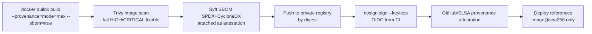

# 09 — Container & Supply-Chain Security

**Baselines:** CIS Docker Benchmark, CIS Kubernetes Benchmark, Kubernetes Pod Security Standards (**restricted**), NIST SP 800-190 (Application Container Security), SLSA Build Level 3 (target), NIST SSDF.

Scope: everything from `package.json` to a running pod — dependencies, images, registries, runtime, orchestrator, hosts.

---

## 1. Dependency supply chain

| Control | Implementation |
|---------|----------------|
| Reproducible installs | `pnpm install --frozen-lockfile` everywhere (CI, Docker). Lockfile committed and reviewed |
| Delay fresh releases | `.npmrc` / `pnpm-workspace.yaml`: `minimumReleaseAge: 4320` (3 days). New versions are unusable until they've been public for 72h, which defends against worm/hijack incidents that are usually caught within hours |
| Block install scripts | pnpm `onlyBuiltDependencies` allowlist (e.g. `prisma`, `@prisma/engines`, `argon2`, `esbuild`). Every other package's lifecycle scripts are disabled |
| Vulnerability scanning | `osv-scanner` + `pnpm audit --prod` in CI. Fail on **critical/high with a fix available**. Anything else goes to a tracked backlog with an expiry |
| Update hygiene | Renovate: weekly batched updates, grouped by ecosystem, auto-merge **patch** updates of dev-deps only after CI passes. Majors need a manual PR |
| Minimise dependencies | New runtime dependency = justify in the PR (maintenance, downloads, maintainers, license). Prefer the platform/stdlib |
| License policy | Allow MIT/Apache-2.0/BSD/ISC/MPL-2.0. Flag GPL/AGPL/SSPL for review (license checker in CI) |
| Registry | npm official registry only (optionally via a caching proxy). No git-URL dependencies |
| Provenance | Prefer packages published with npm provenance. Verify with `pnpm audit signatures`/`npm audit signatures` in CI |

## 2. Image build standards

### 2.1 Rules (MUST)
1. **Multi-stage builds.** Build tools, dev dependencies and source never reach the runtime stage.
2. **Minimal runtime base:** distroless Node (`gcr.io/distroless/nodejs24-debian12` or the current Debian-based equivalent) or Chainguard/Wolfi `node`. No shell or package manager in runtime images.
3. **Pin base images by digest** (`@sha256:…`). Renovate updates the digests.
4. **Run as non-root** (UID/GID 65532 or `nonroot`), with numeric UID so Kubernetes `runAsNonRoot` can verify it.
5. **No secrets in build args, layers or the final image.** Use BuildKit `--mount=type=secret` if a build needs a secret (it shouldn't).
6. `.dockerignore` excludes `.git`, `.env*`, `node_modules`, `coverage`, `**/*.pem`, `docs`, tests.
7. Files in the image are owned by root and read-only to the app user. The app writes only to explicit tmpfs/volumes.
8. `NODE_ENV=production`. No `HEALTHCHECK` in distroless (orchestrator probes are used instead).
9. OCI labels: `org.opencontainers.image.source`, `.revision`, `.created`, `.version`.
10. One process per container. API and worker use the same image with a different `CMD`.

### 2.2 Reference Dockerfile (`infra/docker/api.Dockerfile`)
```dockerfile
# syntax=docker/dockerfile:1.10
ARG NODE_IMAGE=node:24-bookworm-slim@sha256:<pinned>
ARG RUNTIME_IMAGE=gcr.io/distroless/nodejs24-debian12:nonroot@sha256:<pinned>

FROM ${NODE_IMAGE} AS base
ENV PNPM_HOME=/pnpm PATH=/pnpm:$PATH CI=true
RUN corepack enable
WORKDIR /repo

FROM base AS deps
COPY pnpm-lock.yaml pnpm-workspace.yaml .npmrc ./
RUN --mount=type=cache,id=pnpm,target=/pnpm/store pnpm fetch --frozen-lockfile

FROM deps AS build
COPY . .
RUN --mount=type=cache,id=pnpm,target=/pnpm/store \
    pnpm install --frozen-lockfile --offline \
 && pnpm --filter @univarse/db prisma:generate \
 && pnpm turbo run build --filter=@univarse/api... \
 && pnpm --filter=@univarse/api deploy --prod --legacy /out

FROM ${RUNTIME_IMAGE} AS runtime
LABEL org.opencontainers.image.source="https://github.com/<org>/univarse"
ENV NODE_ENV=production NODE_OPTIONS="--enable-source-maps --max-old-space-size=768"
WORKDIR /app
COPY --from=build --chown=0:0 --chmod=0555 /out /app
USER 65532:65532
EXPOSE 8080
CMD ["dist/main.js"]          # worker: ["dist/worker.js"]
```
Web (`apps/web`) uses Next.js `output: 'standalone'` with the same pattern (`CMD ["server.js"]`).

### 2.3 Third-party service images
Gotenberg, ClamAV, Caddy, PgBouncer, Valkey, SeaweedFS: official images **pinned by digest**, scanned like ours, run with the same runtime hardening (§4), and never exposed publicly.

## 3. Build pipeline: scan, SBOM, sign, attest



- **Trivy** also scans for misconfigurations (Dockerfile, Helm, Terraform) and secrets in image layers.
- Build on **ephemeral, hosted CI runners** with OIDC federation to the cloud (no long-lived cloud keys in CI).
- **Tags are mutable, digests aren't.** Deployments reference `image@sha256:…`. Tags (`v1.4.2`, `sha-abc123`) are for humans only.
- Nightly re-scan of all deployed image digests. A new critical CVE opens an issue automatically and pages if it's exploitable and internet-facing.
- **Registry:** private (GHCR/ECR/Artifact Registry), immutable tags enabled, vulnerability scanning on push, retention policy (keep last 50 + all released), pull restricted to the cluster's identity.

## 4. Runtime hardening

### 4.1 Kubernetes (production)
```yaml
# Pod spec excerpt (Helm values enforce these for every workload)
automountServiceAccountToken: false
securityContext:
  runAsNonRoot: true
  runAsUser: 65532
  runAsGroup: 65532
  fsGroup: 65532
  seccompProfile: { type: RuntimeDefault }
containers:
  - name: api
    image: registry.example/univarse/api@sha256:<digest>
    securityContext:
      allowPrivilegeEscalation: false
      readOnlyRootFilesystem: true
      privileged: false
      capabilities: { drop: ["ALL"] }
    resources:
      requests: { cpu: "250m", memory: "512Mi" }
      limits:   { memory: "1Gi" }          # CPU limit optional; memory limit required
    volumeMounts: [{ name: tmp, mountPath: /tmp }]
    livenessProbe:  { httpGet: { path: /health/live,  port: 8080 } }
    readinessProbe: { httpGet: { path: /health/ready, port: 8080 } }
volumes: [{ name: tmp, emptyDir: { medium: Memory, sizeLimit: 64Mi } }]
```

| Control | Setting |
|---------|---------|
| Pod Security Admission | Namespace label `pod-security.kubernetes.io/enforce: restricted` |
| Admission policy | **Kyverno** (or Gatekeeper): require signed images from our registry (cosign verify), require digests, disallow `:latest`, require resource limits, require non-root, disallow hostPath/hostNetwork/hostPID, disallow NodePort/LoadBalancer outside the ingress namespace |
| Network policies | **Default deny** ingress and egress per namespace. Then allow: gateway → web/api; web → api; api/worker → pgbouncer, redis, storage endpoint, gotenberg, clamav; worker → egress proxy for providers; DNS |
| Egress | External egress only through an **egress proxy/NAT with an allowlist**: gateway APIs, SMS/email providers, KMS/secret manager, OTel collector. Blocks SSRF and data exfiltration |
| Service accounts | One per workload, no token automount. Workload identity (IRSA/GKE WI) scoped to exactly the secrets/buckets needed |
| Secrets | External Secrets Operator ← cloud secret manager. etcd encryption at rest enabled. Secrets mounted as files where possible |
| Namespaces | `univarse-app`, `univarse-data` (pgbouncer/redis if self-hosted), `univarse-support` (gotenberg, clamav), `ingress`, `observability` |
| Disruption | PodDisruptionBudgets, ≥ 2 replicas for web/api, topology spread across zones |
| Runtime detection | Falco (or cloud equivalent) rules: shell spawned in container, unexpected outbound connection, write to read-only paths |
| Cluster | Managed control plane, private API endpoint (or authorised networks), RBAC least privilege, audit logs enabled, nodes auto-upgraded, CIS benchmark scan (kube-bench) quarterly |

### 4.2 Docker Compose (dev / staging-lite / small single-host deployments)
```yaml
x-hardening: &hardening
  read_only: true
  user: "65532:65532"
  cap_drop: [ALL]
  security_opt: ["no-new-privileges:true"]
  tmpfs: ["/tmp:size=64m"]
  restart: unless-stopped
  logging: { driver: json-file, options: { max-size: "10m", max-file: "5" } }

services:
  api:
    image: registry.example/univarse/api@sha256:<digest>
    <<: *hardening
    env_file: [/etc/univarse/api.env]      # root-owned 0600 on host, NOT in repo
    networks: [app, data]
    deploy: { resources: { limits: { memory: 1g, cpus: "1.0" } } }
  postgres:
    image: postgres:18@sha256:<digest>
    networks: [data]                         # no `ports:` — never published
networks:
  app: {}
  data: { internal: true }                   # no external connectivity
```
Rules:
- **Never publish database, Redis, object storage (SeaweedFS), ClamAV or Gotenberg ports** to the host/internet. Only the edge proxy publishes 80/443. (The v0 compose exposed 5433/5434/6379. Don't repeat that.)
- Never mount `/var/run/docker.sock` into a container. If a tool needs it, use a filtered socket proxy, or don't use that tool.
- Use rootless Docker or user-namespace remapping (`userns-remap`) on hosts.
- Secrets via host files with `0600` permissions or Docker secrets. Never in the compose file.

## 5. Host hardening (VMs / nodes)

- Minimal OS (Ubuntu LTS minimal, Bottlerocket, or the provider's container-optimised OS) with automatic security updates.
- SSH: keys only, no root login, restricted to a bastion/VPN (WireGuard/Tailscale) or replaced by SSM/IAP. No password auth.
- Host firewall: deny all inbound except 443/80 on edge nodes. Management only via VPN.
- CIS Level 1 benchmark hardening (automated with Ansible or provider images), with auditd enabled.
- Disk encryption at rest (provider default). Encrypted backups ([10](10-infrastructure-and-deployment.md)).
- Time sync (chrony) is required: TOTP, audit timestamps and certificates depend on it.

## 6. Service-to-service security

- TLS for all connections leaving a node: app → managed Postgres (`sslmode=verify-full`), app → Redis (TLS + AUTH/ACL user), app → object storage (HTTPS).
- In-cluster: NetworkPolicies as the baseline. Add a service mesh (Linkerd, for mTLS) only if/when operational maturity allows it. It's not required for GA.
- Redis: ACL users per purpose (`app`, `worker`), `rename-command`/ACL-deny dangerous commands (`FLUSHALL`, `CONFIG`, `KEYS`).
- Gotenberg and ClamAV accept requests only from the worker/API network. Gotenberg has Chromium JavaScript disabled and outbound network blocked (render only from supplied HTML).

## 7. Infrastructure as Code security

- Terraform in `infra/terraform/`. Remote state in an encrypted, versioned bucket with locking. State access limited to CI deploy role + admins.
- Checkov/Trivy config scans on every PR. Policies: no public buckets, no `0.0.0.0/0` on non-edge ports, encryption on, logging on, deletion protection on databases.
- Plans are reviewed in PRs. Applies happen only from CI with an approval gate for prod.
- Drift detection runs weekly (`terraform plan` in CI, alert on diff).

## 8. Verification checklist (release gate)

- [ ] All images built in CI, signed, SBOM + provenance attached, referenced by digest
- [ ] Trivy: 0 fixable HIGH/CRITICAL in deployed images
- [ ] Runtime images run as UID 65532, read-only root FS, all caps dropped, seccomp RuntimeDefault
- [ ] Kyverno policies in `Enforce` mode (not `Audit`) in prod
- [ ] NetworkPolicies default-deny verified (a test pod can't reach Postgres from an unauthorised namespace)
- [ ] No service exposes data ports publicly (external port scan in the pre-release checklist)
- [ ] Secrets only from the secret manager. `trivy fs --scanners secret` clean on the repo
- [ ] kube-bench / Docker Bench findings triaged
