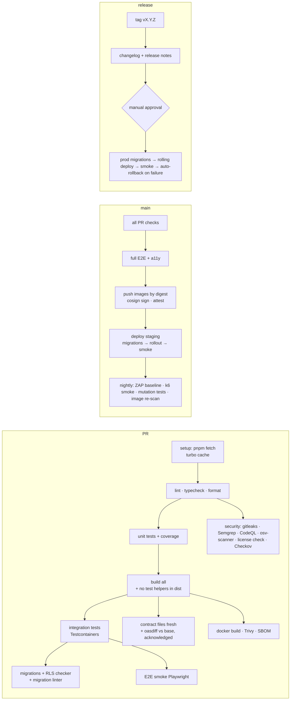

# 13 — CI/CD & Development Workflow

## 1. Source control

- **Git from day one.** Hosted on GitHub (private), `main` protected.
- **Trunk-based development:** short-lived branches (`feat/results-approval-flow`, `fix/gpa-rounding`, `chore/…`, `docs/…`, `sec/…`), merged within ~1–3 days. Big features hide behind feature flags rather than living on long branches.
- **Branch protection on `main`:** PR required, all status checks green, linear history (squash merge), signed commits (SSH/GPG) required, no force pushes, CODEOWNERS for `packages/domain`, `packages/db`, `infra/`, `docs/08*`, `docs/09*`.
- **Commits:** Conventional Commits (`feat(results): add HOD return action`). A commitlint hook enforces them. Scope = module name.
- **PR template** (`.github/pull_request_template.md`) includes: summary, linked roadmap item, screenshots, checklists from [08 §13](08-security.md) and [12 §8](12-testing-strategy.md), migration notes, rollback notes, and the API breaking changes section.
- **API breaking changes** ([spec 0011](specs/0011-openapi-and-api-client.md) D4, report-only):
  - The `api-contract` workflow runs oasdiff on the PR's `openapi.json` against the base branch and writes every change to the job summary.
  - **When it fails:** only when a breaking change (oasdiff level ERR) isn't acknowledged in the PR description.
  - **What counts as acknowledged:** an `## API breaking changes` section that names each broken operation as `METHOD /path`, plus an `Open tabs:` line saying how a browser tab still running the previous web app copes. First-party clients can stay open across a deploy; the usual answer is expand → migrate → contract.
  - **Re-evaluation:** the check re-runs when the description is edited.
  - **Enforcement:** `api-breaking-changes` is a required status check in the `protect-main` ruleset, together with `build-test` and `secrets-scan`.
- **Review:** solo phase: self-review + AI review (`/code-review`) + CI. Every change to auth, RLS, payments or results engines gets a deliberate second pass the next day ("sleep on it" rule) or a second reviewer once the team grows.

## 2. Local quality gates (pre-commit via lefthook)

- `prettier --check` (staged), `eslint` (staged), `tsc -b` (affected), `gitleaks protect --staged`, commitlint.
- Keep hooks under 10 s. Anything heavier runs in CI.

## 3. CI pipeline (GitHub Actions)

- **Turborepo remote cache** keeps PR CI under ~10 min. Affected-only execution for lint/test on large changes.
- **Required checks** block merge: lint, typecheck, unit, integration, RLS, contract diff (unless labelled `breaking-approved`), security scans (no new high/critical), Trivy, E2E smoke.
- **CI security:**
  - Actions pinned by commit SHA
  - `permissions: read-all` default, elevated per job
  - OIDC to cloud (no static keys)
  - environment protection rules for `staging`/`production`
  - secrets scoped to environments
  - no secrets exposed to fork PRs
  - Dependabot/Renovate for action updates

## 4. Versioning & releases

- **SemVer** for the product. `CHANGELOG.md` generated from conventional commits (release-please).
- Release cadence: every 2 weeks during build phases. Weekly after GA, plus hotfixes as needed.
- **Hotfix:** branch from `main`, fix + test, fast-track the pipeline (the same gates apply; only the approval wait is shortened).
- **Release notes for tenants:** a user-facing summary per release in the console and an in-app "What's new". Breaking changes to tenant workflows are announced ≥ 2 weeks ahead.

## 5. Database changes in the pipeline

1. PR: the migration is generated, reviewed and linted (Squawk). The RLS checker runs on a fresh DB. Staging-size migration timing is estimated for big tables.
2. Merge: staging migrations run automatically before the rollout.
3. Release: prod `MigrationRun` across shards. The rollout proceeds only when every shard succeeds.
4. Contract-phase (destructive) migrations ship in a **later** release than the code that stopped using the old structure.

## 6. Environments & config promotion

- The same image digest is promoted from staging to prod. **Never rebuild for prod.**
- Config differences live only in Helm values per environment + secret manager entries. All env vars are validated at boot by a zod schema.
- Feature flags default **off** in prod for new features. They're enabled per pilot tenant first.

## 7. Work management

- Roadmap phases ([18](18-roadmap.md)) → epics per module → issues with acceptance criteria copied from [05](05-modules-and-features.md).
- Labels: `module:*`, `type:{feat,bug,chore,sec,docs}`, `priority:{p0..p3}`, `phase:*`, `needs-adr`.
- Every issue that touches a business rule links the rule section in [04](04-business-rules.md) and the relevant fixture.

## 8. Working with Claude Code on this repo

- `CLAUDE.md` at the repo root (from [templates/CLAUDE.md](templates/CLAUDE.md)) tells the agent the invariants, commands and where the docs are.
- Work in **vertical slices**: contract → migration → domain → use case → API → UI → tests, one feature at a time. Ask for a plan (plan mode) before multi-module changes.
- Use `/code-review` before merging and `/security-review` on auth/payment/results/RLS changes.
- Use a git worktree per parallel task to keep changes isolated.
- Keep the docs in the loop: if the implementation reveals a rule is wrong, update [04](04-business-rules.md) and the fixtures in the same PR.
