# 18 — Roadmap

Nine phases (plus Phase 4b, Teaching & Learning + CA CBT) from an empty repo to GA. Each phase ships **working, deployed, tested vertical slices**: backend + UI + tests + docs together. No module is "done" on mock data.

Sizes are rough effort estimates for **one developer working with AI assistance**. They're for sequencing, not promises. Re-estimate at each phase start.

```mermaid
gantt
  dateFormat  X
  axisFormat  %s
  section Build
  P0 Foundations            :p0, 0, 6
  P1 Platform control plane :p1, after p0, 4
  P2 Institution setup      :p2, after p1, 5
  P3 Admissions + Bursary   :p3, after p2, 8
  P4 Records + Registration :p4, after p3, 6
  P4b Teaching + CA CBT     :p4b, after p4, 7
  P4c UniVarse Live (media) :p4c, after p4b, 5
  P5 Exams + Results        :p5, after p4b, 8
  section Pilot
  Pilot tenant go-live (returning students) :milestone, after p5, 0
  P6 Graduation + Transcripts :p6, after p5, 6
  P7 Hostel, Comms, Helpdesk, Reporting :p7, after p6, 6
  P8 Hardening + GA         :p8, after p7, 5
```

*(Units are weeks. Total ≈ 61 weeks. Phases 6–8 overlap with pilot support. Because products are enabled independently (ADR-020), the pilot can go live on Core + Bursary + Academics even if Phase 4b slips. Results accept manually entered CA scores.)*

---

## Phase 0 — Foundations (~6 wks)

**Goal:** a secure, multi-tenant skeleton that every later module builds on.

- Monorepo (pnpm + Turborepo), shared configs, lefthook, commitlint, CI pipeline ([13](13-ci-cd-and-workflow.md)) with all security scans
- `compose.dev.yml` (Postgres 18, PgBouncer, Valkey, MinIO, Mailpit, Gotenberg, ClamAV)
- `packages/db`: platform + tenant Prisma schemas, roles/grants, **RLS template + checker**, `forTenant`, `withTenantTx`, API `ShardRegistry`
- API skeleton: NestJS/Fastify, config validation, tenant resolver, Problem Details filter, rate limiting, security headers, health endpoints, OTel + Pino, OpenAPI generation, `packages/api-client` generation
- **Identity:** users, argon2id, activation via OTP, login/logout, sessions (cookie), password reset, TOTP MFA, step-up, roles/permissions/scoped assignments, `PolicyService`
- **Audit** (hash chain), **outbox** + relay + BullMQ worker skeleton, **files** (presigned upload, ClamAV scan), **settings** module with typed keys
- Web skeleton: auth pages, workspace shell with permission-driven nav, design system in `packages/ui` with brand tokens, Storybook
- Staging environment (single VM, hardened compose, managed Postgres)

**Exit criteria:**
- Two seeded tenants. The cross-tenant test suite passes (all 5 layers of [12 §3](12-testing-strategy.md))
- Login + MFA + step-up E2E green. CSP enforced on staging
- Images signed, 0 high/critical findings. Staging deploy is automatic from `main`
- ADRs 001–012 accepted

**Deferred by [ADR-024](19-decision-log.md) (local-first, 2026-10-05):** the staging-only criteria above wait for cloud staging. They are CSP and HTTPS cookies on staging, the automatic staging deploy, backups and restore, and ADR-018's closure. They are not met, and Phase 0 is reported as "closed locally, staging gates deferred" until they are. Image scanning and signing run in CI meanwhile.

## Phase 1 — Platform control plane (~4 wks)

- Console app (separate host, IP allowlist, mandatory MFA), platform identity
- Tenant registry, **provisioning job** (idempotent/resumable), subdomains, custom-domain verification + on-demand TLS
- Lifecycle: suspend/resume/offboard with warning emails, tenant export, purge (two-person rule)
- Feature flags, platform announcements, migrations runner (per shard), platform audit
- Basic plans/subscriptions (manual invoicing is acceptable)

**Exit:** J1 E2E green. A tenant can be created → provisioned → admin activated in < 10 min. Suspended tenant is blocked (423).

## Phase 2 — Institution setup (~5 wks)

- Org units tree, staff profiles, bulk user/staff import with activation invites
- Programmes, courses, curriculum versions (items, electives, prerequisites), approval
- Academic sessions/semesters, calendar windows, **session rollover wizard** (dry run)
- Settings UI for all `[CONFIG]` keys (grading scheme, approval stages, registration limits, matric template…), branding, integrations screen (gateway keys, write-only)
- Generic import framework (upload → validate → preview → commit) used by all modules

**Exit:** J2 E2E green. A pilot institution's structure, programmes and curricula are imported from its real spreadsheets (anonymised) without code changes.

## Phase 3 — Admissions & Bursary core (~8 wks)

- Finance: fee items, fee schedules (rule matching, instalments, approval), invoices, **ledger**, **Paystack + Remita adapters** (Flutterwave next), webhooks, verify sweeps, receipts with QR, statements, waivers, reconciliation (daily + CSV upload), bursary reports
- Admissions: cycles, applicant portal, O'level/DE entry, uploads, form fee, JAMB imports, Post-UTME score import, aggregate & merit lists with quotas, CAPS export/re-import, offers + letters, acceptance fee, document verification, **enrolment → student + matric number**
- Document generation pipeline (Gotenberg) + `/verify/{code}`
- Email + SMS adapters, templates, notifications center (basic)

**Exit:**
- J3 E2E green
- Payment webhook storm load test passes with zero double credits
- Reconciliation catches injected mismatches
- CSP/security review of payment pages done

## Phase 4 — Student records & Course registration (~6 wks)

- Student profiles, status changes, sensitive-data access controls, programme transfer (basic)
- **Legacy student + legacy results import** (critical for pilot go-live with returning students)
- Course offerings from curricula, lecturer allocation, class lists
- Student course registration with all [04 §5](04-business-rules.md) rules, fee gate, adviser approval, add/drop, late registration, printable course form

**Exit:** J4 E2E green. The registration-opening load test passes. The pilot's legacy data imports with reconciliation reports (counts, CGPA re-computation match ≥ 99.9%, and every mismatch explained).

## Phase 4b — Teaching & Learning + Assessment (CA CBT) (~7 wks)

Spec first (spec 0004 for Teaching & Learning, spec 0005 for Assessment; spec 0003 is product entitlements) from [05 §18–19](05-modules-and-features.md).

- **Product plumbing (ADR-020):** `tenant_product` entitlements, `@Product()` route/job guard, `PRODUCTS=…` runtime roles (`api-learning`, `realtime`), per-role PgBouncer pools, per-product queues and rate limits
- Course spaces from registration events. Materials, announcements, assignments with submission, marking and release
- **Live lecture engagement** on the `realtime` role: rotating-code attendance check-in, polls, moderated Q&A, with HTTP-polling fallback
- **CA CBT:** question banks with versioning, test definitions, pre-generated seeded papers, server-authoritative timer, autosave and resume, exactly-once submission, integrity logging (no auto-penalties), auto- and manual marking, regrade on key correction
- **CA → results contract:** `assessment.ca_scores_released` event → score-sheet CA component (only while the sheet is editable)

**Exit:**
- CBT peak load test: **2,000 candidates start within 60 s, zero lost answers**, start p95 ≤ 2 s, errors < 0.1%
- **Cross-product isolation test:** Assessment saturated while Bursary p95 stays within SLO
- Crash/reconnect tests: no acknowledged answer lost. Submission is exactly-once under parallel submits
- Integrity: attempt logs are append-only and audited. Score changes after release only via the amendment path
- Live engagement: 500 concurrent participants with poll/Q&A round-trip p95 ≤ 1 s

## Phase 4c — UniVarse Live (media) (~5 wks, parallel with Phase 5)

Per ADR-022. It starts with a **cost and bandwidth spike** (1 week): SFU egress per participant at audio+slides vs video, TURN usage, recording storage. Then:
- Self-hosted LiveKit (SFU + TURN + egress) in the infra plan. Join tokens minted by the API for registered members only
- Lecturer publishes, students request to speak. Presence-based attendance. Polls/Q&A from Phase 4b inside the call
- Audio + slides default. **Video implemented and optional**: lecturer camera and screen share, student cameras allowed per course, simulcast layers, per-participant audio-only receive (low-data mode). Recordings → scanned course materials, plus an audio + slides rendition of video sessions
- Audit of joins, leaves, role changes and recordings. Egress cost per tenant

**Exit:** 300 participants per room on a constrained-bandwidth load test, with audio continuity ≥ 99%. The test is run in both modes: audio + slides, and lecturer video on with most students on audio-only receive. Recordings appear in the course space. Isolation: a Live spike leaves other products within SLO.

## Phase 5 — Examinations & Results (~8 wks)

- Venues, exam timetable with conflict detection, invigilators, eligibility, dockets
- Assessment schemes, score entry grid + CSV upload, **approval workflow with SoD**, broadsheets/mastersheets, statistics, Senate recording, publication, student result view, statement of result
- CA components **always** accept typed or CSV-uploaded scores, so institutions without CA CBT (not entitled, or not live yet) run paper CA as today. Where CBT is used, released CBT scores arrive through `assessment.ca_scores_released` (Phase 4b contract) into the same CA component
- **GPA/CGPA/standing engine** with golden fixtures from the pilot institution, amendments, probation/withdrawal recommendations
- Anomaly detection jobs on score changes

**Exit:**
- J5–J7 E2E green
- Result-release load test (10k VUs) passes
- **Pilot UAT: one past semester replayed with a 100% match to the official broadsheet** ([12 §9](12-testing-strategy.md))
- Runbooks for incident response, payments and publication written
- DPIA v1 signed, DPA with the pilot signed

### 🚩 Milestone: Pilot go-live
Private university, returning students first (fees → registration → results for one semester). Hypercare for 4 weeks: daily check-ins, extra monitoring, a deploy freeze around deadlines.

## Phase 6 — Clearance, Graduation, Transcripts, NYSC (~6 wks)

- Clearance templates/cases with auto-checks, officer queues
- Degree audit, graduation lists with approvals and class of degree, `GRADUATED` status
- Transcript requests (payment, processing, generation, dispatch tracking), certificates data, public verification hardening (rate limits, anti-enumeration)
- NYSC list export

**Exit:** J8 E2E green. The pilot registry issues 20 transcripts matching historical ones.

## Phase 7 — Hostel, Communications, Helpdesk, Reporting (~6 wks)

- Hostel setup, allocation rounds, applications, holds/expiry, check-in/out, damages → clearance
- Announcements with targeting, preferences, SMS cost tracking and caps
- Tenant helpdesk + escalation to platform support
- Dashboards per role, standard reports, NUC-style returns export, read replica for reporting

**Exit:** J9 E2E green. Dashboards are scoped correctly (tested). The reporting load doesn't affect OLTP p95.

## Phase 8 — Hardening & General Availability (~5 wks)

- **External penetration test**, with remediation and retest
- Full DAST, threat-model refresh, kube-bench/Docker Bench, Kyverno in Enforce
- Kubernetes production topology with HPA/KEDA, multi-AZ, PDBs, pre-scaling automation
- DR drill (full + single tenant) meeting RPO/RTO. Status page. On-call tooling
- WebAuthn/passkeys, PWA shell, accessibility audit (WCAG 2.2 AA)
- Compliance pack complete ([16 §9](16-compliance-ndpa.md)), NDPC registration `[VERIFY]`
- Tenant onboarding playbook, pricing, SLA document, customer documentation site

**GA exit criteria:**
- All SLOs met for 30 days on the pilot
- Cross-product isolation load test passes (ADR-020)
- 0 open critical/high security findings
- DR drill passed within targets
- A second tenant onboarded in ≤ 10 working days using only the console and imports

## Deferred by product decision ([01 §5.5](01-product-brief.md))

| Item | Prerequisite |
|---|---|
| **CBT for examinations** (and Post-UTME) | CA CBT proven in production for at least a full session. Exam-grade lockdown and venue workflow, legal review |
| **Native mobile apps** for students and lecturers | Stable public API. Token-based auth for native clients (new ADR, superseding the ADR-005 note) |
| **3D virtual labs** for practical-heavy courses | Teaching & Learning embeddable-content sandbox. Content partnerships |
| **Inter-institution access ("campus embassies")** | Federation module per ADR-021: bilateral agreements, guest projections, signed result exchange, inter-institution DPAs |

## Post-GA backlog (prioritise with customers)

Postgraduate school · polytechnic (ND/HND) & college of education (NCE) structures · external LMS interoperability (LTI) · student email provisioning · offline-first PWA · digital signatures (PAdES) on transcripts · alumni portal · parent/guardian access · library integration · outbound webhooks/public API · ISO 27001 readiness · Hausa/Yoruba/Igbo UI.

---

## Working rhythm inside a phase

1. **Plan:** for each module, read [05](05-modules-and-features.md) → confirm rules in [04](04-business-rules.md) → add entities to [03](03-domain-model.md) if needed → threat-model delta ([08 §2](08-security.md)).
2. **Slice:** pick the thinnest end-to-end slice (e.g. "HOD approves one score sheet") → contract → migration → domain → use case → API → UI → tests.
3. **Harden:** edge cases, authorization matrix, load checks, docs, runbook.
4. **Demo** on staging with seed data. Collect feedback from the pilot contact.
5. **Close the phase** only when its exit criteria are demonstrably met (a link to evidence goes in the phase issue).
